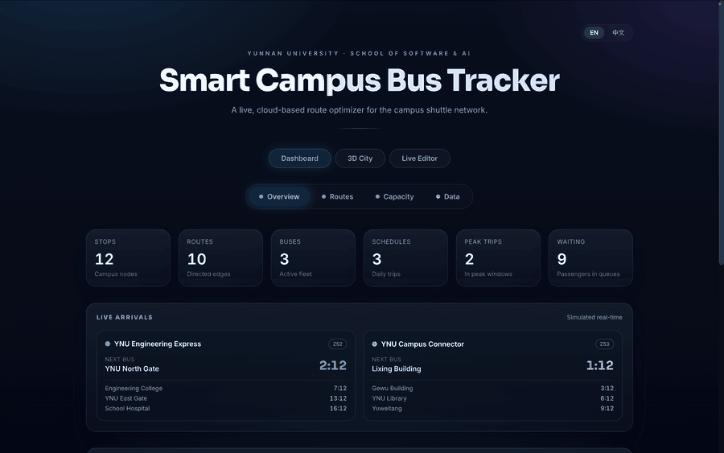
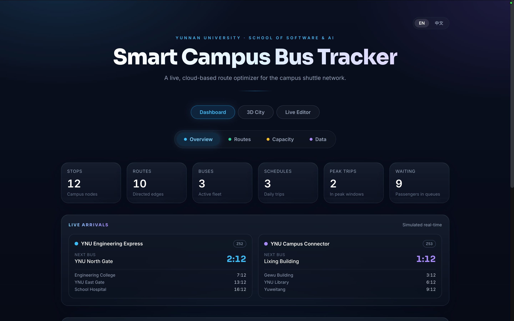
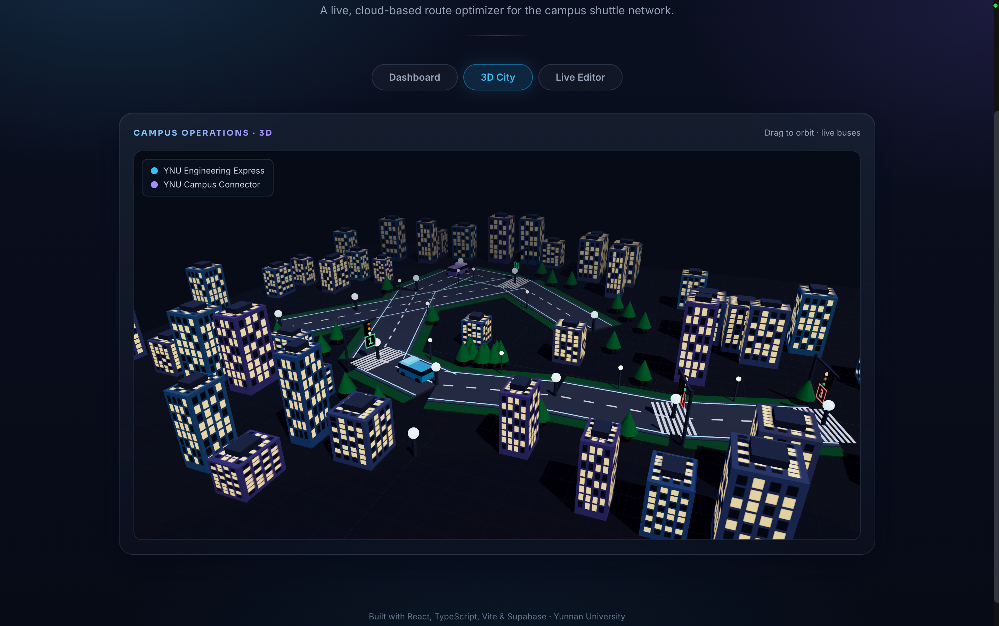
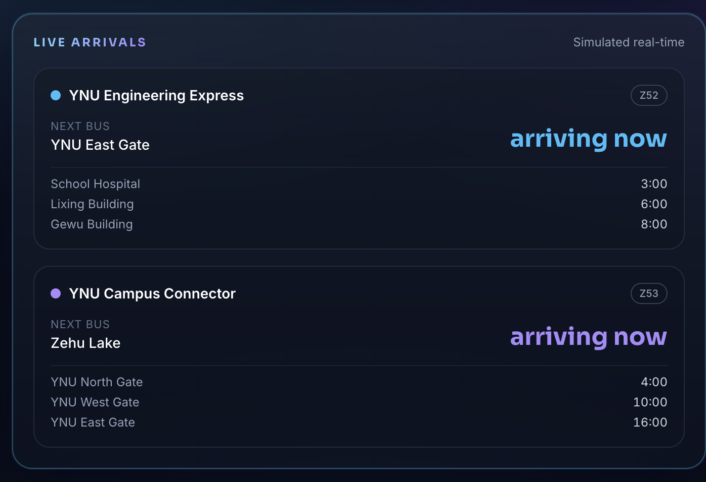
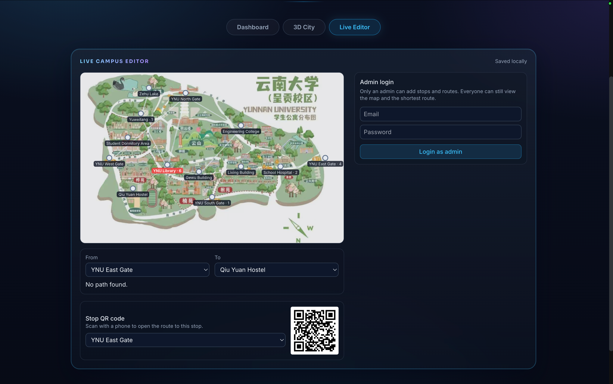
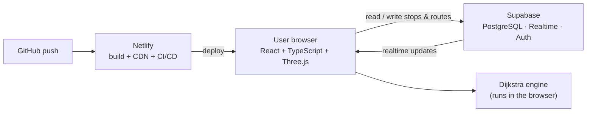

<div align="center">

# 🚌 YNU Smart Mobility

### Your Campus. Your Route. Your Journey.

A full-stack web app with a live **3D city view**, Dijkstra route optimization, cloud database, real-time sync, admin auth, and continuous deployment — the web companion to a C++ course project at Yunnan University. (Formerly "Smart Campus Bus Tracker" — same project, rebranded.)

[](#)
[](#)
[](#)
[](#)
[](#)
[](#)
[](#)
[](#)

**[▶ Live demo](https://ynu-bus-tracker.netlify.app)**



</div>

---

## ✨ Overview

Smart Campus Bus Tracker turns a classic C++ data-structures project into a live, production-style product. It shows the Yunnan University shuttle network on an interactive map, computes the shortest route between any two stops with **Dijkstra's algorithm**, and renders a real-time **3D miniature city** where buses drive the real route-board loops, pause at stops, and obey traffic lights with second-countdowns.

Everything is backed by a real cloud database with live sync across devices, gated admin editing, and automatic deployment on every push.

## 📊 At a glance

| | |
|---|---|
| Campus stops · route edges | 12 · 10 |
| Bus lines simulated in real time | 2 (Z52, Z53) |
| Route search | Dijkstra, computed client-side in **< 1 ms** |
| Initial JS payload | **~132 KB gzipped**, split into app / React / Supabase vendor chunks so a code change doesn't invalidate the whole cache — the 3D scene is a separate lazy chunk (135 KB gzipped, loaded only when that tab opens) |
| Imagery | route board optimised **4.7 MB → 282 KB** (−94%) |
| Offline | full app shell + campus imagery precached (PWA, 15 entries) |
| Tests | 41 unit tests, run on every push by GitHub Actions |
| Accessibility | skip link, landmarks, `aria-pressed`/`aria-current`, live regions, reduced-motion, `<html lang>` follows the toggle |
| Languages | English + 中文, full UI toggle |
| Data safety | admin can export/import a full JSON backup — works with zero network |

*Lighthouse scores measured with the Lighthouse CLI against the production build (`npm run build && npm run preview`); real-world scores vary with network and device.*

## 🎬 Screenshots

| Dashboard | 3D City |
|---|---|
|  |  |

| Live arrivals & ETA | Live editor (admin) |
|---|---|
|  |  |

> Or try the **[live demo](https://ynu-bus-tracker.netlify.app)** — open the **3D City** tab and drag to orbit while the buses run.

## 🚀 Features

- **AI campus assistant (tool-calling agent)** — ask *"How long from East Gate to the Library?"* in English or Chinese. An LLM running in a **serverless function** calls the app's own Dijkstra search as a tool, so every travel time it quotes is genuinely computed, never hallucinated. The model key never reaches the browser, and the assistant degrades gracefully to a local rule-based parser when no key is configured.
- **Dijkstra shortest-route** — pick any From/To, choose a bus line, and apply an emergency delay to watch the path re-route live.
- **3D live city (Three.js)** — a night-lit miniature campus with wide roads, lane markings, greenery, buildings with lit windows, street lamps, crosswalks, and **traffic lights with a real second-countdown**. Buses drive the true route loops and pause at each stop.
- **Live arrivals + ETA** — a real-time board counting down each bus's arrival at every stop, with **favourite stops** pinned to the top.
- **Service alerts** — delays and unusually crowded stops surface as an alert strip, the way real transit apps announce disruptions.
- **Step-by-step trip itinerary** — results read as *board → ride N min → alight*, not a flat list of stop names.
- **Works offline** — the app shell and campus imagery are precached, and an offline banner explains what still works.
- **Cloud database (Supabase / PostgreSQL)** — stops and routes are stored online and shared across devices.
- **Real-time sync** — a change on one screen appears instantly on every other open screen.
- **Admin auth** — only a signed-in admin can add / edit / delete; everyone else has a read-only view.
- **Full CRUD + passenger crowding** — add and remove stops/routes and set waiting-passenger counts; the busiest stop is highlighted.
- **JSON backup/restore** — an admin can export the full campus dataset to a file and re-import it later, so a flaky connection to the cloud never risks losing data.
- **Bilingual EN / 中文** — a language toggle translates the whole UI; stop names are bilingual.
- **Installable PWA** — add to a phone home screen and open it like a native app.
- **CI/CD** — every push is built and deployed automatically.

## 🧱 Tech Stack

| Layer | Technology |
|------|------------|
| Frontend | React 18 · TypeScript · Vite 5 · Tailwind CSS |
| AI | Gemini / Claude with tool calling, via a Netlify serverless function |
| 3D | Three.js |
| Algorithm | Dijkstra shortest path (TypeScript) |
| Database | Supabase (PostgreSQL) |
| Realtime & Auth | Supabase Realtime · Supabase Auth |
| Hosting / CI-CD | Netlify (auto-deploy from GitHub) |
| Mobile | Progressive Web App |

## 🗺️ Architecture



## 🧑‍💻 Run locally

```bash
git clone https://github.com/mamunur-ynu/ynu-bus-tracker-app.git
cd ynu-bus-tracker-app
npm install
npm run dev        # open the local URL Vite prints
```

To enable the cloud, add your Supabase URL and publishable key in `src/lib/supabaseConfig.ts`. Without them the app still runs using browser storage.

To enable the **AI assistant**, add a model key in your Netlify site (Site configuration → Environment variables):

| Variable | Provider | Notes |
|---|---|---|
| `AI_API_KEY` (+ optional `AI_BASE_URL`, `AI_MODEL`) | any OpenAI-compatible API | Zhipu GLM, Qwen, Groq, DeepSeek… Defaults to Zhipu `glm-4-flash`, which has a free tier |
| `GEMINI_API_KEY` | Google Gemini | free tier, no card required |
| `ANTHROPIC_API_KEY` | Claude | paid |

Example for Groq: `AI_API_KEY=<key>`, `AI_BASE_URL=https://api.groq.com/openai/v1`, `AI_MODEL=llama-3.3-70b-versatile`.

The key is only read inside the serverless function — it never reaches the browser. Without any key the assistant automatically falls back to a local rule-based parser that still computes real routes.

```bash
npm run build      # production build → dist/
npm run preview    # preview the production build
```

## 📁 Project structure

```
netlify/functions/
  assistant.mts           serverless AI agent (tool calling → Dijkstra)
src/
  App.tsx                 tabs: Dashboard · 3D City · Ask AI · Live Editor
  algorithms/dijkstra.ts  shortest-path engine (+ unit tests)
  components/
    MiniCity3D.tsx        the Three.js 3D city
    AIAssistant.tsx       chat UI for the assistant
    LiveArrivals.tsx      real-time ETA board
    ShortestRouteDemo.tsx interactive map + route
    LiveEditor.tsx        cloud CRUD + admin auth
  data/campusData.ts      stops, routes, bus lines
  lib/                    cloud, persistence, i18n, toast, assistant
```

## 📚 Context

This web app is the companion to the C++ final course project *"Smart Campus Bus Tracker and Route Optimizer"* for the School of Software and Artificial Intelligence, Yunnan University. The C++ console system is the main academic deliverable; this app extends the same idea into a live, cloud-based product.

**→ [C++ repository](https://github.com/mamunur-ynu/yunnan-university-smart-campus-bus-tracker)** — OOP design, STL, Dijkstra, and the 46-page project report.

## 👤 Author

**MAMUN MD MAMUNUR RASHID** — Artificial Intelligence, Yunnan University.

<div align="center">

⭐ If you like this project, consider giving it a star.

</div>
